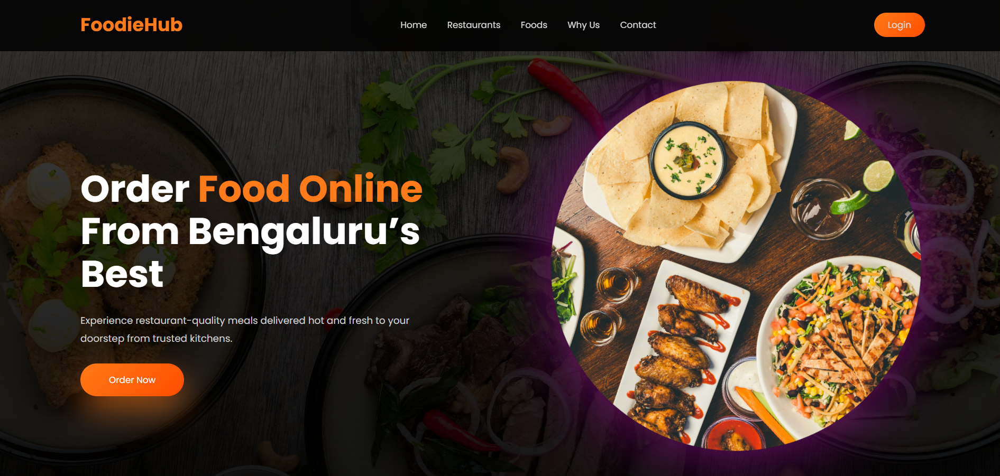
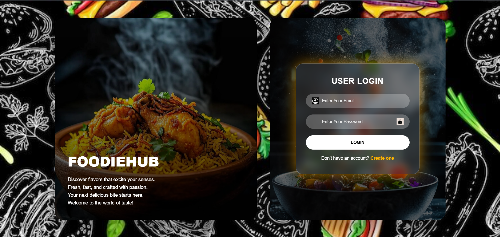
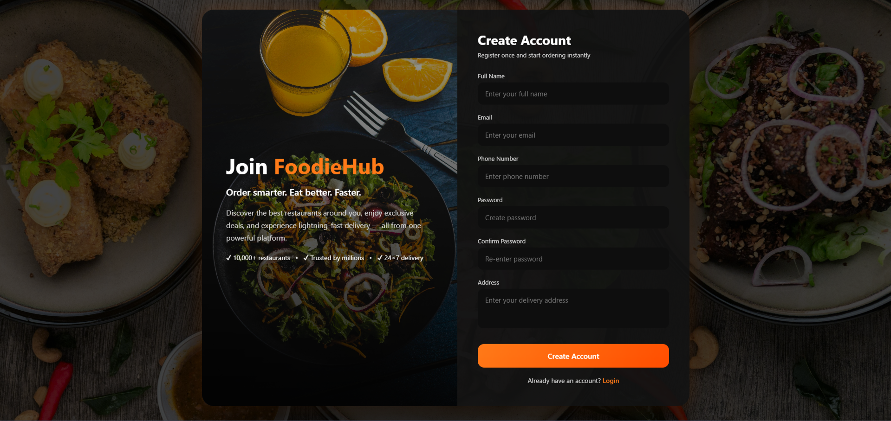
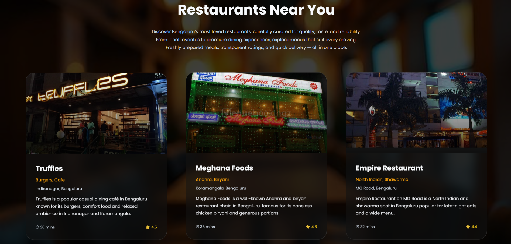
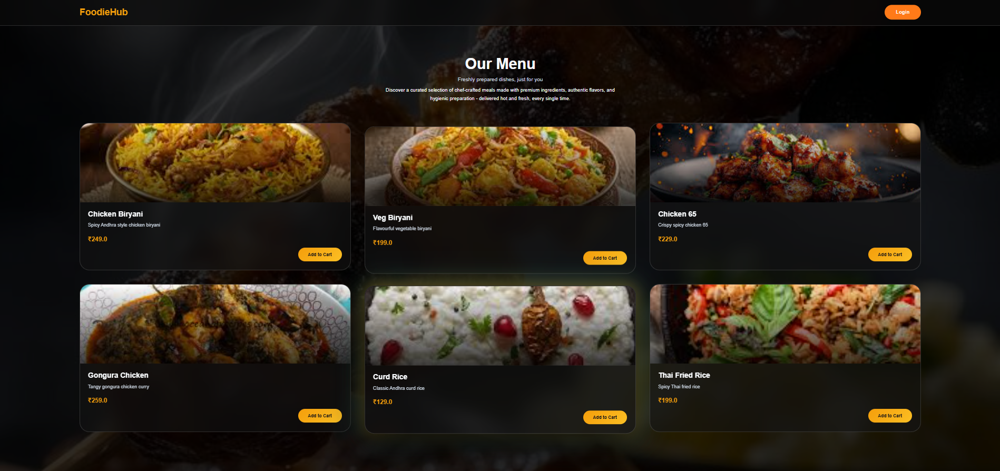
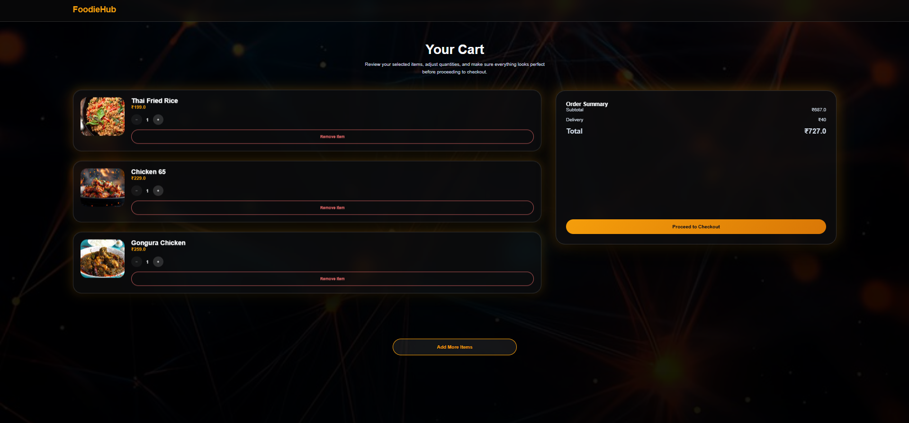
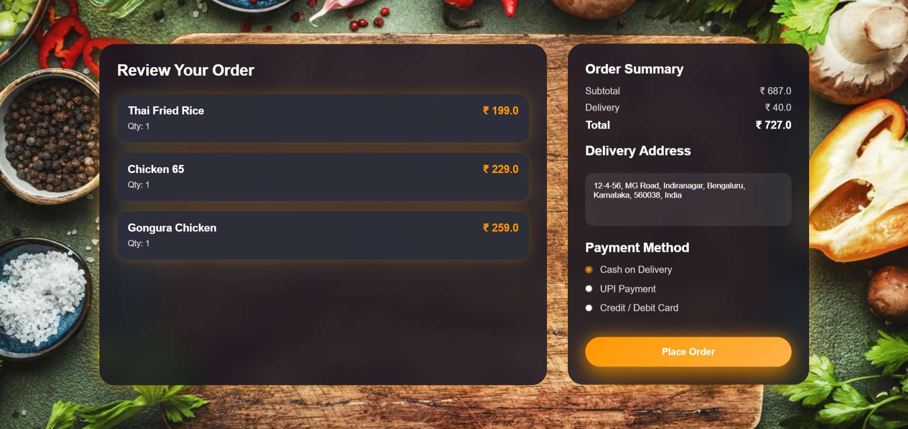
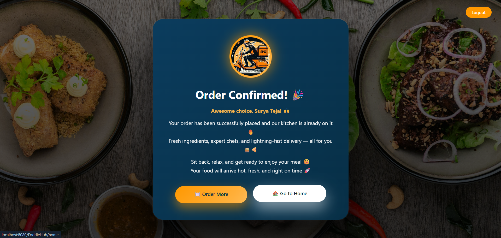

## 🍔 FoodieHub - Online Food Delivery System

A full-stack online food delivery web application built using Java Enterprise technologies. Users can browse restaurants, explore menus, add items to cart, place orders, and manage their food ordering experience through an intuitive web interface.

---

## 📖 Project Overview

FoodieHub is a dynamic food delivery platform developed using Java, Servlets, JSP, JDBC, MySQL, and Maven.

The application enables customers to:

- Register and login securely
- Browse available restaurants
- Explore restaurant menus
- Add food items to cart
- Update cart quantities
- Place food orders
- View order details
- Manage their food ordering experience

The project follows a layered architecture using DAO Design Pattern and MVC principles to ensure maintainability and scalability.

---

## ✨ Features

### 👤 User Management

- User Registration
- User Login Authentication
- Session Management
- Secure Logout
- User Profile Handling

### 🏪 Restaurant Management

- View Available Restaurants
- Restaurant Details
- Restaurant Ratings
- Dynamic Restaurant Listing

### 🍽 Menu Management

- Browse Food Menus
- View Item Details
- Dynamic Menu Loading
- Restaurant-Based Menu Display

### 🛒 Cart Functionality

- Add Items To Cart
- Update Item Quantity
- Remove Items From Cart
- Cart Persistence Using Session
- Calculate Total Amount

### 📦 Order Management

- Checkout Process
- Order Placement
- Order Summary
- Order Confirmation
- Order History

### 🎨 User Interface

- Responsive Design
- Modern UI Layout
- Dynamic JSP Pages
- Interactive Navigation
- User-Friendly Experience

---

## 🛠 Tech Stack

### Backend

- Java 21
- JDBC
- Servlets
- DAO Design Pattern

### Frontend

- HTML5
- CSS3
- JSP (Java Server Pages)

### Database

- MySQL

### Build Tool

- Maven

### Application Server

- Apache Tomcat 9

### IDE

- Eclipse IDE

### Version Control

- Git
- GitHub

---

## 🗄️ Database Schema

The application uses MySQL as the relational database.

### Users

| Column   | Type     |
| -------- | -------- |
| user_id  | INT (PK) |
| name     | VARCHAR  |
| email    | VARCHAR  |
| password | VARCHAR  |
| phone    | VARCHAR  |
| address  | VARCHAR  |

### Restaurants

| Column          | Type     |
| --------------- | -------- |
| restaurant_id   | INT (PK) |
| restaurant_name | VARCHAR  |
| cuisine_type    | VARCHAR  |
| rating          | DOUBLE   |
| delivery_time   | INT      |

### Menu

| Column        | Type     |
| ------------- | -------- |
| menu_id       | INT (PK) |
| restaurant_id | INT (FK) |
| item_name     | VARCHAR  |
| description   | VARCHAR  |
| price         | DOUBLE   |
| image_path    | VARCHAR  |

### Orders

| Column        | Type      |
| ------------- | --------- |
| order_id      | INT (PK)  |
| user_id       | INT (FK)  |
| restaurant_id | INT (FK)  |
| total_amount  | DOUBLE    |
| order_date    | TIMESTAMP |
| status        | VARCHAR   |

### Order Items

| Column        | Type     |
| ------------- | -------- |
| order_item_id | INT (PK) |
| order_id      | INT (FK) |
| menu_id       | INT (FK) |
| quantity      | INT      |
| subtotal      | DOUBLE   |

---


## 🏗 System Architecture

```text
+-----------------------+
|      Client/User      |
+-----------------------+
            |
            v
+-----------------------+
|       JSP Pages       |
| (Presentation Layer)  |
+-----------------------+
            |
            v
+-----------------------+
|       Servlets        |
| (Controller Layer)    |
+-----------------------+
            |
            v
+-----------------------+
|      DAO Layer        |
| (Business Logic)      |
+-----------------------+
            |
            v
+-----------------------+
|         JDBC          |
| (Database Access)     |
+-----------------------+
            |
            v
+-----------------------+
|        MySQL          |
|       Database        |
+-----------------------+
```

---

## 📂 Project Structure

```text
FoodieHub
│
├── src
│   └── main
│       ├── java
│       │   ├── com.food.dao
│       │   │
│       │   ├── com.food.daoimpl
│       │   │
│       │   ├── com.food.model
│       │   │
│       │   ├── com.food.servlet
│       │   │
│       │   └── com.food.util
│       │
│       └── webapp
│           ├── images
│           │
│           ├── WEB-INF
│           │
│           ├── home.jsp
│           ├── login.jsp
│           ├── register.jsp
│           ├── restaurant.jsp
│           ├── menu.jsp
│           ├── cart.jsp
│           ├── orderConfirm.jsp
│           └── orderSuccess.jsp
│
├── pom.xml
├── README.md
├── LICENSE
└── .gitignore
```

---

## 🗄 Database Schema

### Users Table

```sql
CREATE TABLE users (
    userId INT PRIMARY KEY AUTO_INCREMENT,
    name VARCHAR(100),
    username VARCHAR(100),
    password VARCHAR(255),
    email VARCHAR(100),
    address VARCHAR(255),
    role VARCHAR(20)
);
```

### Restaurant Table

```sql
CREATE TABLE restaurant (
    restaurantId INT PRIMARY KEY AUTO_INCREMENT,
    name VARCHAR(100),
    cuisineType VARCHAR(100),
    address VARCHAR(255),
    rating FLOAT,
    imagePath VARCHAR(255)
);
```

### Menu Table

```sql
CREATE TABLE menu (
    menuId INT PRIMARY KEY AUTO_INCREMENT,
    restaurantId INT,
    itemName VARCHAR(100),
    description TEXT,
    price DECIMAL(10,2),
    imagePath VARCHAR(255)
);
```

### Orders Table

```sql
CREATE TABLE orders (
    orderId INT PRIMARY KEY AUTO_INCREMENT,
    userId INT,
    restaurantId INT,
    totalAmount DECIMAL(10,2),
    status VARCHAR(50),
    orderDate TIMESTAMP
);
```

### OrderItem Table

```sql
CREATE TABLE orderitem (
    orderItemId INT PRIMARY KEY AUTO_INCREMENT,
    orderId INT,
    menuId INT,
    quantity INT,
    price DECIMAL(10,2)
);
```

---

## 🔄 Application Workflow

```text
User Registration
        ↓
User Login
        ↓
Browse Restaurants
        ↓
Select Restaurant
        ↓
View Menu
        ↓
Add Items To Cart
        ↓
Update Cart
        ↓
Proceed To Checkout
        ↓
Place Order
        ↓
Order Confirmation
        ↓
Order Success
```

---

## ⚙ Installation Guide

### Step 1: Clone Repository

```bash
git clone https://github.com/Surya63023/FoodieHub-Online-Food-Delivery-System.git
```

---

### Step 2: Import Project

1. Open Eclipse IDE
2. File → Import
3. Maven → Existing Maven Projects
4. Select Project Folder
5. Click Finish

---

### Step 3: Configure MySQL Database

1. Create MySQL Database

```sql
CREATE DATABASE foodiehub;
```

2. Create Required Tables

```sql
users
restaurant
menu
orders
orderitem
```

3. Insert Sample Data

4. Verify Database Connectivity

---

### Step 4: Configure Database Credentials

Update your database connection settings inside:

```text
DBUtil.java
```

Example:

```java
private static final String URL =
    "jdbc:mysql://localhost:3306/foodiehub";

private static final String USERNAME =
    "root";

private static final String PASSWORD =
    "your_password";
```

---

### Step 5: Configure Tomcat Server

1. Download Apache Tomcat 9
2. Add Server Runtime in Eclipse
3. Configure Apache Tomcat
4. Add Project To Server

---

### Step 6: Build Project

```bash
mvn clean install
```

Expected Output:

```text
BUILD SUCCESS
```

---

### Step 7: Run Application

1. Right Click Project
2. Run As → Run on Server
3. Select Apache Tomcat
4. Finish

---

### Step 8: Access Application

```text
http://localhost:8080/FoodieHub/home
```

---

## 📸 Application Screenshots

### 🏠 Home Page



### 🔐 Login Page



### 📝 Register Page



### 🏪 Restaurant Listing Page



### 🍽 Menu Page



### 🛒 Cart Page



### 📦 Order Confirmation Page



### ✅ Order Success Page



---

## 🚀 Future Enhancements

### Backend

- Spring Boot Migration
- Spring Security Integration
- REST API Development
- JWT Authentication
- Microservices Architecture

### Frontend

- React.js Frontend
- Responsive Mobile UI
- Advanced Search Filters

### Database

- PostgreSQL Support
- MongoDB Integration
- Redis Caching

### DevOps

- Docker Containerization
- Kubernetes Deployment
- Jenkins CI/CD Pipeline
- AWS Cloud Deployment

### Features

- Payment Gateway Integration
- Admin Dashboard
- Restaurant Dashboard
- Real-Time Order Tracking
- Email Notifications
- SMS Notifications
- User Reviews & Ratings

---

## 📊 Project Highlights

- Enterprise Java Web Application
- MVC Architecture
- DAO Design Pattern
- Session Management
- Maven Build Management
- JDBC Database Connectivity
- MySQL Integration
- Dynamic JSP Pages
- Cart Management System
- Order Processing Workflow
- Git Version Control
- GitHub Repository Management

---

## 👨‍💻 Author

### Surya Teja

Aspiring Java Full Stack Developer

#### Connect With Me

GitHub:
https://github.com/Surya63023

LinkedIn:
(Add Your LinkedIn Profile Here)

---

## 📜 License

This project is licensed under the MIT License.

See the LICENSE file for more details.

---

⭐ If you found this project useful, consider giving it a star on GitHub.
